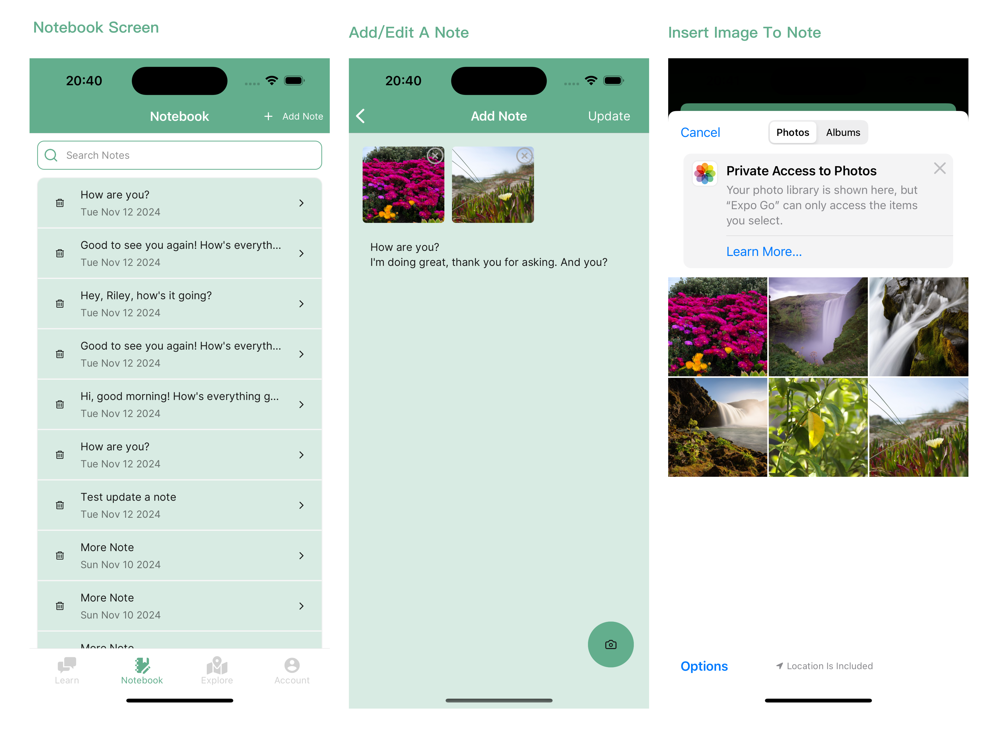

### ChatSprout - Grow Your Networking Skills

Do you feel anxious at networking events or struggle with making small talk in professional settings? Chat Sprout prepares you for every networking opportunity. 

---

### Current State
1. **
2. *Finished the Notebook related features*

---

### Team Contributions

**Xinyu Zeng:**
1. **Navigation**
   - Set up and configured the main app navigation using `@react-navigation` with a bottom tab navigator (`TabNavigator`).

2. **Notebook Functionality**
   - Developed the `NotebookScreen` where users can view, add, search, and delete notes, notes are sorted by timestamp.
   - Integrated Firebase to fetch notes data in real-time, ensuring that any `CRUD operations` are instantly reflected on the screen.
   - Integrated `SearchBar` with real-time filtering by title or content for quick access to specific notes.

3. **Rich Text Editor / Add Note Screen**
   - Created a custom `RichTextEditor` component to allow users to add rich content to their notes, including text and images.
   - Integrated `expo-image-picker` to allow users to insert images from their device’s gallery into notes.
   - Configured image handling, including deletion functionality, so users can remove images if needed.

4. **Save Conversations to Notebook**
   - Implemented the function that allows users to add conversations directly from the conversation screen to their notebook.
   - Added a success `toast` notification to confirm when a note has been successfully saved. 
