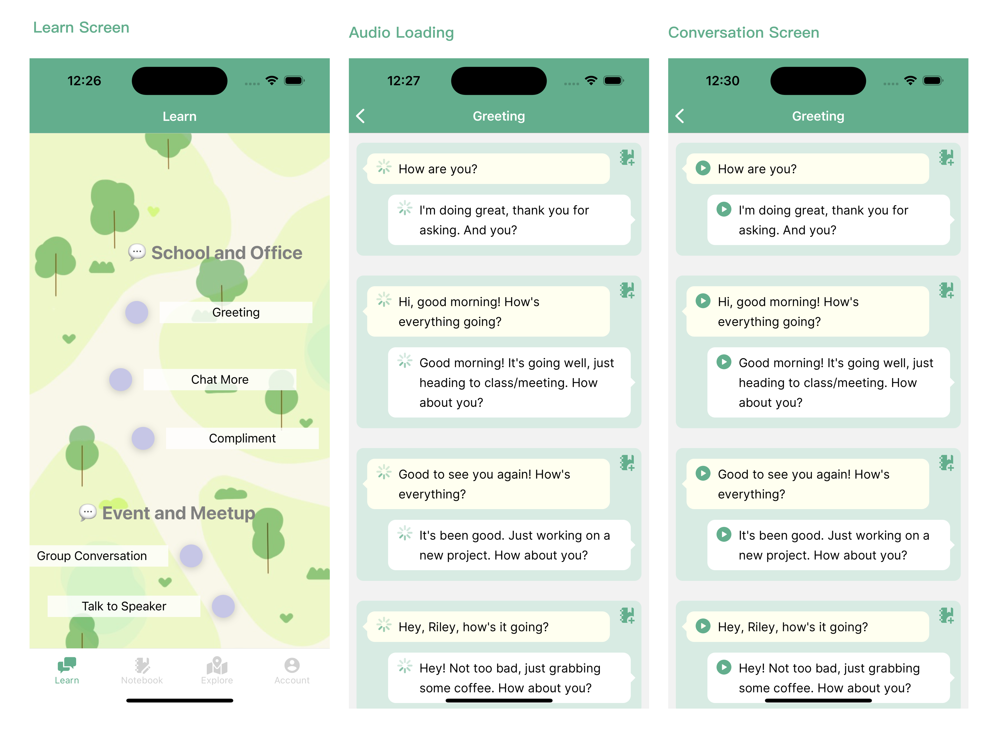
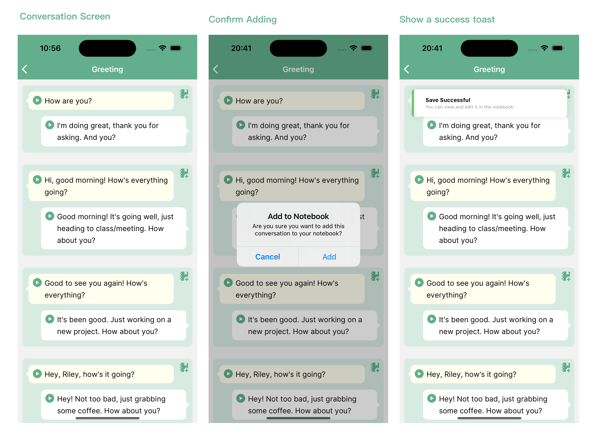
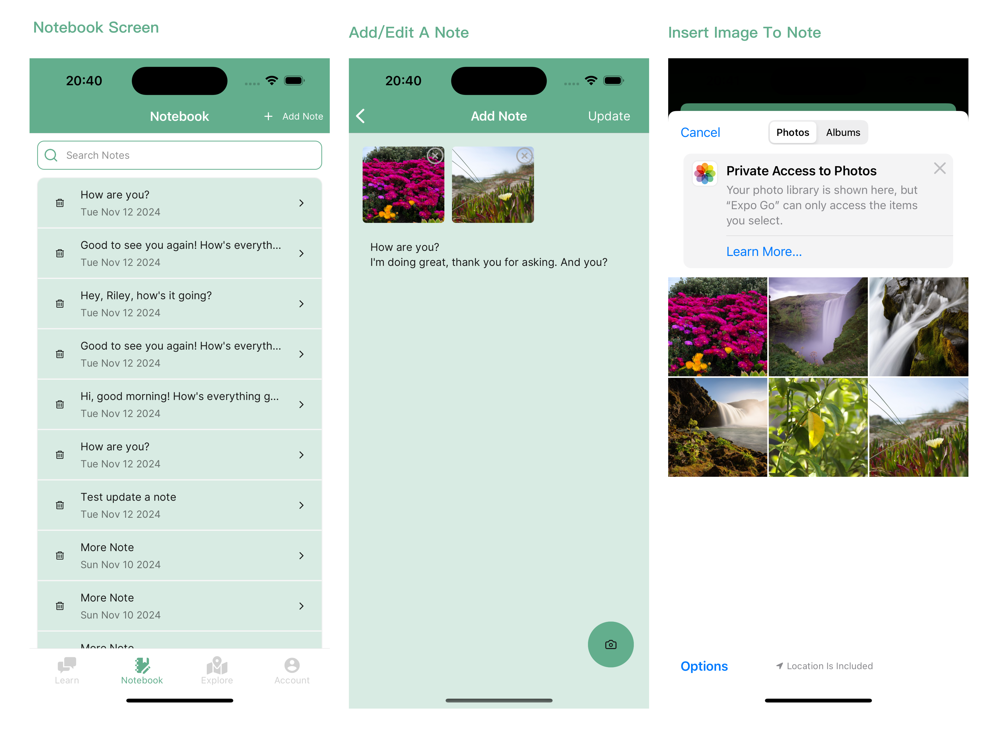
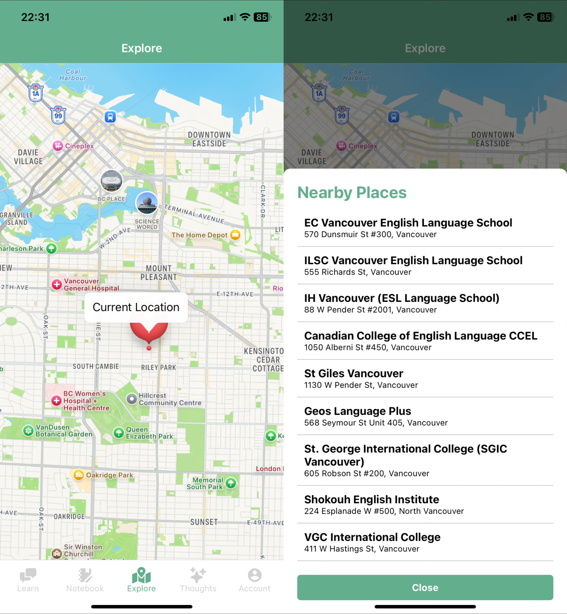
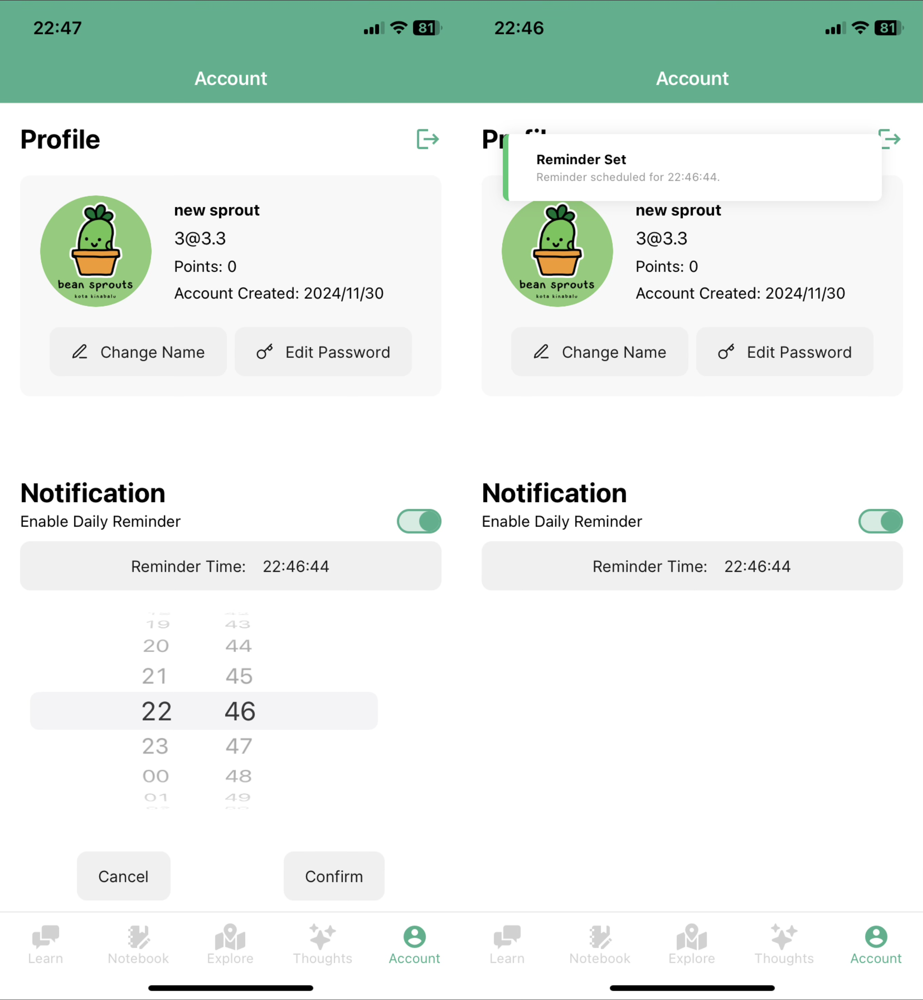
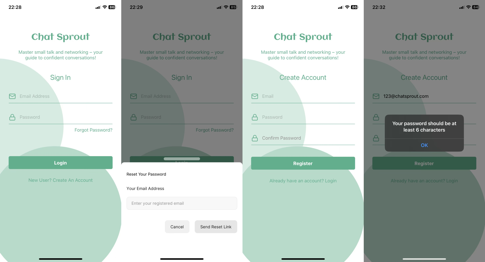
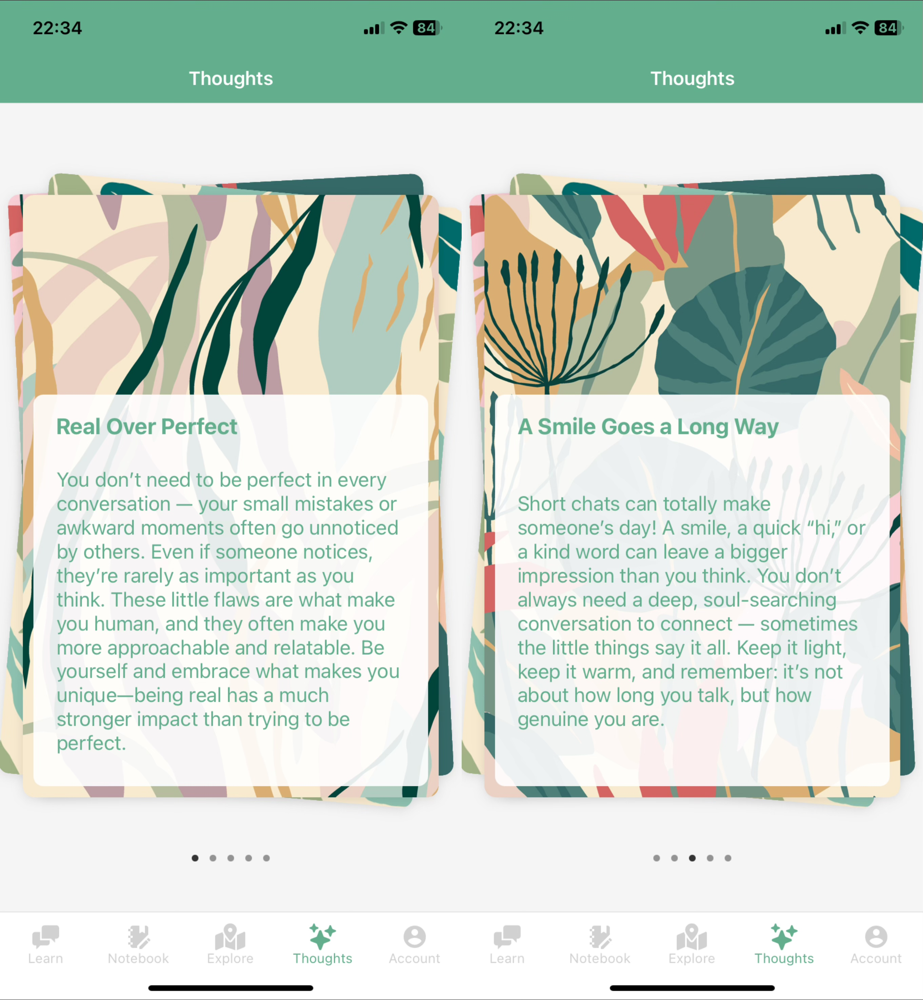

### Chat Sprout - Grow Your Networking Skills

Do you feel anxious at networking events or struggle with making small talk in professional settings? Chat Sprout is designed to help students, international students, and newcomers who want to build confidence in social interactions.

Whether you're attending conferences, industry forums, or interviews, Chat Sprout provides practical tools to help you engage with others seamlessly.

Our app is designed to simplify social situations and help you establish meaningful connections in a professional environment. With tailored conversation starters, icebreaker topics, and common phrases, Chat Sprout prepares you for every networking opportunity.

---

### Current State

1. _Finished learning related feature: browse some conversation starters and play the audio._
   
2. _Conversation can be added as a note to notebook_
   
3. _Finished notebook related features: browse the notes, add/edit/delete notes._
   
4. _New implemented in Iteration 2: when add/update a note, photos can be taken by camera, and the photos saved are saved in firebase storage_
   
5. _New implemented in Iteration 2: Explore Screen: implemented Google Maps API to show the map, will implement the external API Google Places in iteration 3_
   
6. _Account Screen: display user profile and notification setting_
   
7. _New implemented in Iteration 3: Explore Screen: implemented Google Places API to show the nearby language learning schools when user pick a location_
   

8. _New implemented in Iteration 3: Account Screen: improved the layout of account screen and implemented local notification setting_
   

9. _New implemented in Iteration 3: Login & Signup Screen: implemented user authentication and build the pages_
   

10. _New implemented in Iteration 3: Thoughts Screen: display articles to provide mental support to users_
    

---

### Data Model and Collections

1. **Themes Collection -** stores the learning sources we used in our app.
   - Create: Not allowed to create on the mobile app.
   - Read: Retrieved for learn feature.
   - Update: Not allowed to update on the mobile app.
   - Delete: Not allowed to delete on the mobile app.
2. **Notes Collection -** stores notes that users create or save from conversations.
   - Create: When a user adds a new note or saves a conversation as a note.
   - Read: Retrieve all notes for a user.
   - Update: When a user edits the content, title, or images of an existing note.
   - Delete: When a user deletes a specific note.
3. **Users Collection -** stores user profile information and settings.
   - Create: When a new user signs up, a new user document is created in this collection.
   - Read: Retrieve user information and notification setting for account pages.
   - Update: When a user updates their profile information or changes notification preferences.
   - Delete: Not provided on the mobile app.

---

### Team Contributions in Iteration 3

**Xinyu Zeng:**

- **External API Integration: Google Places API**:
  - Integrated Google Places API into the Explore Screen to enhance functionality by allowing users to discover nearby language learning places such as schools or study centers.
  - Location Permissions: Verified and requested foreground location permissions using Expo's Location library to ensure user privacy and app compliance.
  - Dynamic Place Fetching: Implemented logic to fetch and display nearby locations dynamically based on the user's current location or map interactions.
  - Customizable Search: Configured the API to filter results for language-learning-related places by type (school) and keyword (English).
- **Notification: Daily Study Reminder**:
  - Implemented a local notification system that allows users to set daily reminders for their study sessions.
  - Notification Scheduling: Used Expo's Notifications API to schedule daily reminders at a user-defined time.
  - Permission Handling: Verified notification permissions and guided users through enabling them if necessary.
- **UI Beautification: Account, Login, and Signup Screens**
  - Built and improved the visual design and user experience for the Account Screen, Login Screen, Signup Screen, and related components.
  - Consistent Theming: Ensured a consistent color palette, typography, and spacing across screens for better UI coherence.
  - Account Screen: Redesigned the layout to showcase user information cleanly and intuitively.
  - Login & Signup Screens: design the layout and style of the screens, improved component design.

**Mingyi Li:**

- **Thoughts Tab**

  - Thoughts Screen: Users can explore motivational articles about improving social interactions. The screen uses a gesture-based navigation system, allowing users to swipe left or right to move between articles, with an indicator at the bottom for visual clarity.

  - Thoughts Card：Each article is presented using a stacked card interface, creating a visually appealing layout with overlapping cards.
    Cards feature animated movements and randomized background images.

- **Authentication**

  - Embedded authentication feature provided by Firebase Authentication and managed CRUD operations with security rules.
  - Before authentication, users only have access to Signup Screen and Login Screen.
  - Signup: Users can create an account using the Signup Screen, which requires email and password input with confirmation. Upon successful registration, the system creates a new user in Firebase Authentication and stores their information in Firestore, including default fields such as display name, notification preferences, and points.
  - Login and Logout: Existing users can log in using their email and password via the Login Screen. Users can securely log out from their account, which resets their authentication state​.
  - Profile Management: After creating the user document, users can edit user display name and password through Profile on Account Screen.
  - Notes Management: When creating a note document, there is an owner field to record the user identify. Users can only read, update, or delete notes created by themselves.

### Team Contributions in Iteration 2

**Xinyu Zeng:**

- **Built a reusable ImageManager utility component to handle**:
  - Verifying permissions for both camera and library access.
  - Launching the camera or library for image selection.
- **Firebase Integration**:
  - Updated ImageManager to upload images to Firebase Storage under the notes/ directory and returning the download URL.
  - Updated Firestore notes collection to include image URLs for easier preview and retrieval in other parts of the app

**Mingyi Li:**

- **Display User Location**

  - Users can explore their current location through an interactive map interface, enhancing the user experience with a real-time view. The map interface allows users to see their current position, marked with a location pin, creating a sense of personalization.
  - Clicking on the map enables users to update their location dynamically, making the feature interactive and adaptable.

- **Interactive Map Features**
  - The map includes a Marker to pinpoint the user’s real-time location and supports standard map interactions like zooming and panning.
  - The interface provides a seamless experience by showing a loading prompt when fetching the user's location and automatically updating the map once the location is retrieved.

### Team Contributions in Iteration 1

**Xinyu Zeng:**

1. **Navigation**

   - Set up and configured the main app navigation using `@react-navigation` with a bottom tab navigator (`TabNavigator`).

2. **Notebook Functionality**

   - Developed the `NotebookScreen` where users can view, add, search, and delete notes, notes are sorted by timestamp.
   - Integrated Firebase to fetch notes data in real-time, ensuring that any `CRUD operations` are instantly reflected on the screen.
   - Integrated `SearchBar` with real-time filtering by title or content for quick access to specific notes.

3. **Rich Text Editor / Add Note Screen**

   - Created a custom `RichTextEditor` component to allow users to add rich content to their notes, including text and images.
   - Integrated `expo-image-picker` to allow users to insert images from their device’s gallery into notes.
   - Configured image handling, including deletion functionality, so users can remove images if needed.

4. **Save Conversations to Notebook**
   - Implemented the function that allows users to add conversations directly from the conversation screen to their notebook.
   - Added a success `toast` notification to confirm when a note has been successfully saved.

**Mingyi Li:**

- **Learn Tab**

  - Display Themes and Topics

    - Users can explore conversation topics through an `interactive map interface`, adding a `gamified` experience.
      Each theme is visually represented with distinct sections on the map.
    - Clicking on a specific topic `navigates` users to a detailed conversation view.

  - Display Conversations

    - The conversation examples are shown using a `conversation card`, making it easy to browse different dialogues.
    - Each card contains two `conversation bubbles`, presenting the dialogue in a `chat format`. The bubbles alternate direction and color to visually differentiate the sender and receiver, creating a realistic conversation flow. Users can click the play icon on the bubble to listen to the `audio` clip, practicing pronunciation and improving their listening skills.

- **Account Tab**

  - Profile
    - `Displays` user information such as email, name, and password.
    - Users can easily `edit` their profile details using sliding-up sheet.
  - Setting
    - Provides a daily `notification` feature to remind users to practice their conversations.
    - Users can enable or disable the notification with a switch and customize the reminder time using a time picker, ensuring flexibility based on their schedule.
