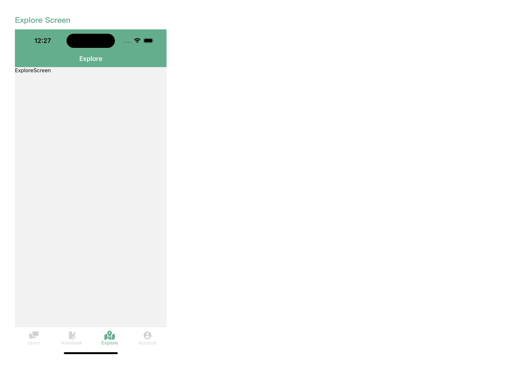

### Chat Sprout - Grow Your Networking Skills

Do you feel anxious at networking events or struggle with making small talk in professional settings? Chat Sprout is designed to help students, international students, and newcomers who want to build confidence in social interactions.

Whether you're attending conferences, industry forums, or interviews, Chat Sprout provides practical tools to help you engage with others seamlessly.

Our app is designed to simplify social situations and help you establish meaningful connections in a professional environment. With tailored conversation starters, icebreaker topics, and common phrases, Chat Sprout prepares you for every networking opportunity.

---

### Current State
1. *Finished learning related feature: browse some conversation starters and play the audio.*

2. *Conversation can be added as a note to notebook*

3. *Finished notebook related features: browse the notes, add/edit/delete notes.*

4. *Account Screen: display user profile and notification setting*

5. *Explore Screen: will implement the external API, EventBrite or Google Places*

---

### Data Model and Collections

1. **Themes-topics-conversations collection -** stores the learning sources we used in our app. Currently stored as a JSON file and not yet stored in the Firebase database.
   - Create: Not allowed to create on the mobile app.
   - Read: Retrieved for learn feature.
   - Update: Not allowed to update on the mobile app.
   - Delete: Not allowed to delete on the mobile app.
2. **Notes Collection -** stores notes that users create or save from conversations.
   - Create: When a user adds a new note or saves a conversation as a note.
   - Read: Retrieve all notes for a user.
   - Update: When a user edits the content, title, or images of an existing note.
   - Delete: When a user deletes a specific note.
3. **Users Collection -** stores user profile information and settings.
   - Create: When a new user signs up, a new user document is created in this collection.
   - Read: Retrieve user information and notification setting for account pages.
   - Update: When a user updates their profile information or changes notification preferences.
   - Delete: Not provided on the mobile app.

---

### Team Contributions

**Xinyu Zeng:**

1. **Navigation**

   - Set up and configured the main app navigation using `@react-navigation` with a bottom tab navigator (`TabNavigator`).

2. **Notebook Functionality**

   - Developed the `NotebookScreen` where users can view, add, search, and delete notes, notes are sorted by timestamp.
   - Integrated Firebase to fetch notes data in real-time, ensuring that any `CRUD operations` are instantly reflected on the screen.
   - Integrated `SearchBar` with real-time filtering by title or content for quick access to specific notes.

3. **Rich Text Editor / Add Note Screen**

   - Created a custom `RichTextEditor` component to allow users to add rich content to their notes, including text and images.
   - Integrated `expo-image-picker` to allow users to insert images from their device’s gallery into notes.
   - Configured image handling, including deletion functionality, so users can remove images if needed.

4. **Save Conversations to Notebook**
   - Implemented the function that allows users to add conversations directly from the conversation screen to their notebook.
   - Added a success `toast` notification to confirm when a note has been successfully saved.

**Mingyi Li:**

- **Learn Tab**

  - Display Themes and Topics

    - Users can explore conversation topics through an `interactive map interface`, adding a `gamified` experience.
      Each theme is visually represented with distinct sections on the map.
    - Clicking on a specific topic `navigates` users to a detailed conversation view.

  - Display Conversations

    - The conversation examples are shown using a `conversation card`, making it easy to browse different dialogues.
    - Each card contains two `conversation bubbles`, presenting the dialogue in a `chat format`. The bubbles alternate direction and color to visually differentiate the sender and receiver, creating a realistic conversation flow. Users can click the play icon on the bubble to listen to the `audio` clip, practicing pronunciation and improving their listening skills.

- **Account Tab**

  - Profile
    - `Displays` user information such as email, name, and password.
    - Users can easily `edit` their profile details using sliding-up sheet.
  - Setting
    - Provides a daily `notification` feature to remind users to practice their conversations.
    - Users can enable or disable the notification with a switch and customize the reminder time using a time picker, ensuring flexibility based on their schedule.
